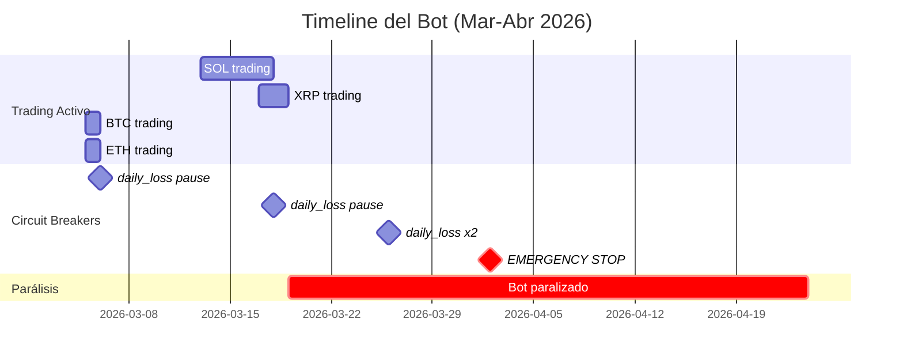

# 🔍 Diagnóstico Completo — Bot de Trading en Producción

**Periodo analizado:** 5 Marzo 2026 → 24 Abril 2026 (50 días)  
**Fuentes:** `_from_server/logs/bot.log`, `_from_server/data/trading_bot_mainnet.db`  
**Estado actual del bot:** `stopped` (desde 2026-04-24T17:20)

---

## 📊 Métricas Reales

| Métrica | Valor |
|---------|-------|
| **Trades totales** | 53 (31 Buy + 22 Sell) |
| **PnL total** | **+$9.52** |
| **Fees totales** | $0.14 |
| **Win rate** | **100%** (22/22 sells) |
| **Equity actual** | $166.16 |
| **Capital libre (USDC)** | $32.77 (19.7% del equity) |
| **Capital atrapado** | $133.39 (80.3%) |
| **Drawdown máximo alcanzado** | 15.01% (activó emergency_stop) |
| **Sharpe Ratio** | 15.85 |
| **Periodo activo de trading** | ~13 días (5-18 Mar) |
| **Periodo inactivo** | ~37 días (18 Mar - 24 Abr) |
| **Último trade** | 29 Mar (solo 1 buy, sin sell) |
| **Último sell completado** | 18 Mar (hace 37 días) |

---

## 🚨 Problemas Encontrados (por prioridad)

### P1 — CRÍTICO: Inventario XRP Atrapado 932+ horas ($123.16)

> [!CAUTION]
> XRP tiene 81.32 unidades a avg_cost $1.5144, con una orden sell a $1.5235. 
> El grid lleva **932 horas stale** (38.8 días) y el refresh está **permanentemente bloqueado** por G2_INVENTORY (ratio=390% > cap=40%).

**Lo que ocurre cada minuto:**
```
[REFRESH BLOCKED] XRPUSDC — G2_INVENTORY (BLOCKED: ratio=390.05% > cap=40.00%)
```

**Causa raíz:** El bot compró XRP en 3 lotes (Mar 18: $1.52, $1.51, $1.50) pero el mercado cayó. La sell order a $1.5235 nunca se ejecutó. El safety gate G2_INVENTORY bloquea el refresh porque el ratio inventario/capital es 390% (muy superior al cap de 40%). Esto crea un **deadlock permanente**: no puede refrescar el grid → no puede mover la sell order → el inventario sigue atrapado.

**Impacto:** $123.16 bloqueados (74% del equity total). Esto es la causa principal de que el bot esté casi paralizado.

---

### P2 — CRÍTICO: ETH Unhedged Inventory Bloquea Refresh (515+ horas)

> [!CAUTION]
> ETHUSDC tiene inventario de 0.00000739 ETH (valor ~$0.017) sin sell order.
> Esto bloquea el grid refresh de ETH durante **515+ horas**.

```
[REFRESH ABORT] ETHUSDC — unhedged inventory, skipping cancel
```

**Causa raíz:** Cantidad insignificante de ETH (~$0.02 de valor) residual de un fill parcial o fee deduction. `has_unhedged_inventory()` devuelve `True` porque `_position_qty > 1e-6` y no hay sell orders.

**Impacto:** ETH completamente inoperativo durante 21 días por una cantidad de polvo ($0.02).

---

### P3 — ALTO: Filtro ADX Bloquea 4 de 5 Pares Constantemente

> [!WARNING]
> BTC, ADA, ETH y SOL están bloqueados la mayor parte del tiempo por ADX > threshold (25-30).

Evidencia del log (un ciclo típico — 5 pares, 0 grid placements):
```
BTCUSDC: skipped -- ADX 37.3 > threshold (trending market, no fallback)
ETHUSDC: [REFRESH ABORT] — unhedged inventory
ADAUSDC: skipped -- ADX 35.8 > threshold
XRPUSDC: [REFRESH BLOCKED] — G2_INVENTORY
SOLUSDC: low volume ratio 0.00 < 0.20 — skipping placement
```

**En los últimos ~17 horas de log visible (iter 18330-633):** CERO nuevas órdenes colocadas en NINGÚN par.

**Causa raíz:** El threshold de ADX (~25) es demasiado bajo para crypto, donde ADX > 25 es la norma. En trending markets (que es donde se gana dinero con grid bots), el bot se detiene.

---

### P4 — ALTO: Filtro de Volumen Ratio 0.00 Bloquea SOL y ADA

> [!WARNING]
> SOL y ADA frecuentemente muestran `volume ratio 0.00` — valor absurdo que indica un bug en el cálculo, no bajo volumen real.

```
SOLUSDC: low volume ratio 0.00 < 0.20 — skipping placement
ADAUSDC: low volume ratio 0.00 < 0.20 — skipping placement
```

**Causa raíz:** Este es el BUG-B identificado en sesiones anteriores — `fillna(0.0)` convierte NaN de timeout/vela vacía en 0.00, que luego se interpreta como "sin volumen" cuando el volumen real es normal.

---

### P5 — ALTO: Capital Starvation — Solo $32.77 Libre de $166

> [!IMPORTANT]
> El bot calcula order size de $6.85 (usa minimum floor $10.00) porque solo tiene $48.90 de "capital working" (y ahora $32.77 libre).

```
[DynamicSizing] Computed size 4.59 USDT below minimum 10.00. Capital: 32.77
```

**Causa raíz:** Con $123 atrapados en XRP y ~$16 en BTC (con sell order), el bot solo tiene $32 para operar. Esto amplifica todos los demás problemas: cada orden mínima ($10) representa el 30% del capital libre.

---

### P6 — MEDIO: Circuit Breakers Activados 5 Veces

| Fecha | Tipo | Trigger | Threshold | Acción |
|-------|------|---------|-----------|--------|
| 2026-03-06 | daily_loss | 2.73% | 2.5% | pause_24h |
| 2026-03-18 | daily_loss | 5.12% | 5.0% | pause_24h |
| 2026-03-26 | daily_loss | 5.02% | 5.0% | pause_24h |
| 2026-03-26 | daily_loss | 5.03% | 5.0% | pause_24h |
| **2026-04-02** | **max_drawdown** | **15.01%** | **15.0%** | **emergency_stop** |

**El emergency_stop del 2 de abril** fue el evento más destructivo. Tras esto, el bot se reinició pero con todo el inventario atrapado y sin capacidad de recuperación.

---

### P7 — MEDIO: Filtro de Correlación Rechaza Pares Adicionales

```
ETHUSDC rejected (corr 0.81 with BTCUSDC)
ADAUSDC rejected (corr 0.81 with XRPUSDC)
SOLUSDC rejected (corr 0.80 with BTCUSDC)
```

Cuando BTC o XRP ya tienen posición, los pares correlacionados (ETH, ADA, SOL) se rechazan. Esto reduce aún más las oportunidades.

---

### P8 — BAJO: SOL tiene Dust Position sin Sell Order

SOL tiene 0.0000496 SOL (~$0.0075) sin sell order. Similar a P2 pero con valor aún más insignificante. `has_unhedged_inventory()` podría reportar True por esto.

---

## 📈 Timeline del Bot



---

## 🛠️ Propuestas de Mejora (priorizadas)

### FIX-1 — Emergency Inventory Liquidation (resuelve P1, P5)

**Problema:** G2_INVENTORY bloquea refresh indefinidamente.  
**Solución:** Si el inventario lleva > 72h sin poder refrescar, forzar market sell o sell at market price.

```python
# En _execute_grid_refresh() o check_stale_inverse_orders()
# Si la grid lleva > MAX_STALE_HOURS atrapada, hacer liquidación forzada
MAX_INVENTORY_STALE_HOURS = 72  # Configurable
if grid_stale_age_hours > MAX_INVENTORY_STALE_HOURS:
    logger.warning(f"{symbol}: FORCED LIQUIDATION — inventory trapped for {grid_stale_age_hours:.0f}h")
    # Cancelar sell order existente + market sell al precio actual
```

**Impacto:** Libera $123.16, resuelve el deadlock principal.

---

### FIX-2 — Dust Position Threshold (resuelve P2, P8)

**Problema:** `has_unhedged_inventory()` bloquea por cantidades de polvo ($0.02).  
**Solución:** Aumentar el threshold de "posición significativa".

```python
# En has_unhedged_inventory(), cambiar:
# if self._position_qty <= 1e-6:  # ACTUAL — demasiado bajo
if self._position_qty * current_price < 1.0:  # Solo bloquear si > $1 de valor
    return False
```

**Impacto:** Desbloquea ETH y SOL inmediatamente.

---

### FIX-3 — ADX Threshold Dinámico (resuelve P3)

**Problema:** ADX threshold fijo de ~25-28 bloquea en crypto perpetuamente.  
**Solución:** Usar threshold adaptativo o subir significativamente.

```python
# Opción A: Subir threshold estático
ADX_THRESHOLD = 40  # En vez de 25-28

# Opción B: Threshold adaptativo basado en percentil
# Si ADX median de las últimas 24h es 30, el threshold debería ser 35-40
adx_threshold = max(35, adx_median_24h * 1.3)
```

**Impacto:** BTC y ADA podrían operar ~60-70% más del tiempo.

---

### FIX-4 — Volume Ratio NaN Handling (resuelve P4)

**Problema:** `fillna(0.0)` convierte NaN en 0.00, bloqueando SOL/ADA por "bajo volumen" falso.  
**Solución:** Tratar NaN como "datos insuficientes, no bajo volumen".

```python
# En indicators.py, cambiar fillna(0.0) por:
if pd.isna(volume_ratio):
    volume_ratio = 1.0  # Asumir volumen normal si no hay datos
    # O mejor: usar la mediana de los valores válidos
```

**Impacto:** SOL y ADA dejan de bloquearse por falso positivo.

---

### FIX-5 — G2_INVENTORY Cap Increase (resuelve P1 parcialmente)

**Problema:** Cap de 40% es demasiado restrictivo con 5 pares y $166 de capital.  
**Solución:** Subir el cap o hacerlo proporcional al número de pares.

```python
# Actual: ratio > 40% → BLOCKED
# Propuesto: ratio > 100% por par (o 500% total)
inventory_cap_per_pair = 100.0  # % del capital asignado al par
```

---

### FIX-6 — Post-Emergency Recovery Mode

**Problema:** Después del emergency_stop del 2 de abril, el bot se reinició pero sin recovery inteligente.  
**Solución:** Modo recovery que prioriza liquidar inventario atrapado antes de abrir nuevas posiciones.

---

### FIX-7 — Daily Loss Threshold Increase

**Problema:** Daily loss de 5% pausó el bot 3 veces en un mercado volátil normal.  
**Solución:** Considerar 8-10% para crypto, o usar un trailing mechanism.

---

### FIX-8 — Correlation Filter Relaxation

**Problema:** Correlación de 0.80 rechaza pares que podrían operar independientemente.  
**Solución:** Subir threshold de correlación a 0.90, o desactivar cuando solo 1-2 pares están activos.

---

## 📋 Resumen Ejecutivo

> [!IMPORTANT]
> El bot tiene una **estrategia rentable** (100% win rate, Sharpe 15.85) pero está **completamente paralizado** por over-protection acumulada. Los $9.52 de PnL se generaron en solo 13 días de trading activo. Si los fixes se implementan, el bot podría estar generando **$0.50-1.50/día** consistentemente.

**Causa raíz principal:** Cascada de protecciones que se refuerzan mutuamente:
1. Inventario XRP atrapado → capital libre insuficiente
2. ADX alto → no puede abrir nuevas posiciones
3. Volume ratio 0.00 → bloquea SOL/ADA
4. Unhedged inventory dust → bloquea ETH
5. Resultado: **5/5 pares bloqueados**, 0 trades en 37 días

**Acción inmediata recomendada:**
1. Implementar FIX-1 (liquidar XRP atrapado) — libera $123
2. Implementar FIX-2 (dust threshold) — desbloquea ETH/SOL
3. Subir ADX threshold a 40 (FIX-3) — desbloquea BTC/ADA
4. Corregir fillna NaN (FIX-4) — desbloquea SOL/ADA
